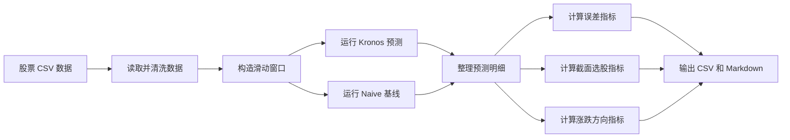

# Kronos 股票预测实验代码框架说明

本文档用于梳理当前实验代码的整体框架，说明每一步做什么、输入是什么、输出是什么，方便组会汇报和后续复现实验。

## 1. 主要脚本

当前实验主要由两个脚本组成：

| 脚本 | 作用 |
|---|---|
| `kronos_stock_forecast.py` | 单次预测脚本。对每只股票取最近一段历史数据，预测未来 `pred_len` 天，并计算逐股票误差指标。 |
| `rolling_window_comparison.py` | 滑动窗口实验脚本。对每只股票构造多个历史窗口，分别运行 Kronos 和 Naive，并计算截面选股指标。 |
| `run_rolling_window_kronos.ps1` | PowerShell 启动脚本，用项目虚拟环境运行滑动窗口实验。 |

目前更重要的是 `rolling_window_comparison.py`，因为 TopK、BottomK、IC、RankIC、涨跌方向准确率等主要实验结果都由它产生。

## 2. 整体流程

实验流程可以概括为：



## 3. 输入数据

输入数据来自股票 CSV 文件夹，默认路径在：

```text
D:\Desktop\时间序列预测\股票预测\data\csi300_daily
```

每个 CSV 文件对应一只股票。代码要求至少包含以下字段：

| 字段 | 含义 |
|---|---|
| `date` | 交易日期 |
| `open` | 开盘价 |
| `high` | 最高价 |
| `low` | 最低价 |
| `close` | 收盘价 |
| `volume` | 成交量 |
| `amount` | 成交额，可选；如果缺失，代码会用 OHLC 均价乘以成交量近似生成 |

数据读取函数是 `load_stock_csv()`。它会做几件事：

1. 统一列名为小写。
2. 检查必要字段是否存在。
3. 将日期转为时间格式。
4. 将价格和成交量转成数值。
5. 删除关键字段缺失的行。
6. 按日期升序排列。
7. 删除重复日期。
8. 补齐 `amount` 字段。

## 4. 实验参数

主要参数来自 `kronos_stock_forecast.py` 和 `rolling_window_comparison.py`。

| 参数 | 当前默认值 | 含义 |
|---|---:|---|
| `model_name` | `NeoQuasar/Kronos-small` | 使用的 Kronos 模型权重 |
| `tokenizer_name` | `NeoQuasar/Kronos-Tokenizer-base` | 使用的 tokenizer |
| `device` | `cpu` | 推理设备 |
| `lookback` | `400` | 每个预测窗口使用过去 400 个交易日作为输入 |
| `pred_len` | `20` | 每次预测未来 20 个交易日 |
| `step` | `20` | 滑动窗口每次向后移动 20 个交易日 |
| `sample_count` | `1` | 每次采样次数 |
| `temperature` | `1.0` | Kronos 采样温度 |
| `top_p` | `0.9` | nucleus sampling 参数 |
| `batch_size` | `16` | 批量推理大小 |
| `max_windows_per_stock` | `3` | 每只股票最多取最近几个窗口；你最近实验中使用过 10 个窗口 |
| `min_cross_section_stocks` | `30` | 每个真实截面至少多少只股票才计算 TopK/BottomK 和 IC |

## 5. 滑动窗口构造

滑动窗口由 `build_rolling_windows()` 完成。

对每只股票，代码按时间顺序切分：

```text
history: 过去 lookback 天
actual : 紧接着的未来 pred_len 天
```

也就是：

```text
[过去 400 天历史数据] -> [未来 20 天真实数据]
```

其中：

- `history` 是模型输入。
- `actual` 是真实未来走势，用来评估预测结果。
- `y_timestamp` 是未来 20 天的日期，传给 Kronos 作为预测时间戳。
- `window_id` 是每只股票内部的窗口编号。

需要注意：`window_id` 不是全市场统一日期编号。不同股票因为停牌、缺失交易日、上市时间不同，相同 `window_id` 可能对应不同真实日期。因此 TopK/BottomK 不能按 `window_id` 分组，必须按真实日期分组。

## 6. 模型预测

### 6.1 Kronos 预测

Kronos 预测由两个函数完成：

| 函数 | 作用 |
|---|---|
| `load_kronos_predictor()` | 加载 Kronos 官方源码、tokenizer 和模型权重 |
| `predict_with_kronos()` | 对单个窗口预测未来 `pred_len` 天 |
| `predict_batch_with_kronos()` | 对多个窗口批量预测，提高效率 |

Kronos 的输入字段是：

```text
open, high, low, close, volume, amount
```

输出也是未来 `pred_len` 天的：

```text
pred_open, pred_high, pred_low, pred_close, pred_volume
```

当前实验主要使用 `pred_close` 来计算收益、IC、RankIC、TopK、BottomK 和涨跌方向。

### 6.2 Naive 基线

Naive 由 `make_naive_prediction()` 生成。

它的逻辑很简单：

- 未来所有 `open/high/low/close` 都等于历史窗口最后一天的价格。
- 未来 `volume` 使用最近 20 天成交量中位数。
- `amount` 使用 `close * volume`。

所以 Naive 是一个“价格不变”的持平基线。它主要用于检查实验流程，而不是强预测模型。

## 7. 预测结果整理

每个窗口预测完成后，会通过 `prediction_frame()` 整理成长表。

每一行表示：

```text
某只股票，在某个窗口下，对未来第 step 天的预测结果
```

主要字段包括：

| 字段 | 含义 |
|---|---|
| `model` | Kronos 或 Naive |
| `stock` | 股票代码 |
| `window_id` | 股票内部窗口编号 |
| `as_of_date` | 预测起点日期，也就是历史窗口最后一天 |
| `step` | 预测未来第几天，范围为 1 到 20 |
| `date` | 真实目标日期 |
| `current_close` | 预测起点的收盘价 |
| `actual_close` | 未来真实收盘价 |
| `pred_close` | 模型预测收盘价 |

最终所有预测明细输出到：

```text
rolling_predictions_all.csv
```

## 8. 指标计算

指标计算由 `summarize_signal_metrics()` 完成。

### 8.1 收益定义

真实收益率：

```text
actual_return = actual_close / current_close - 1
```

预测收益率：

```text
pred_return = pred_close / current_close - 1
```

也就是说，每个未来 step 都和预测起点当天的收盘价比较。

### 8.2 误差指标

代码会计算：

| 指标 | 含义 |
|---|---|
| `MAE` | 平均绝对误差 |
| `RMSE` | 均方根误差 |
| `R2` | 拟合解释度 |

这些指标衡量的是价格预测误差，不直接等于选股能力。

### 8.3 方向指标

代码会计算：

| 指标 | 含义 |
|---|---|
| `Pred_up_probability_pct` | 模型预测上涨比例 |
| `Pred_down_probability_pct` | 模型预测下跌比例 |
| `Pred_flat_probability_pct` | 模型预测持平比例 |
| `Actual_up_probability_pct` | 真实上涨比例 |
| `Actual_down_probability_pct` | 真实下跌比例 |
| `Direction_accuracy_pct` | 预测涨跌方向与真实方向一致的比例 |

当前这里的涨跌方向是相对于 `current_close` 判断的，而不是逐日相邻价格判断。

### 8.4 截面指标

截面指标包括：

| 指标 | 含义 |
|---|---|
| `IC` | 预测收益和真实收益的 Pearson 相关 |
| `RankIC` | 预测收益排名和真实收益排名的 Spearman 相关 |
| `Top10_actual_return_pct_mean` | 预测收益最高前 10% 股票的真实平均收益 |
| `Bottom10_actual_return_pct_mean` | 预测收益最低后 10% 股票的真实平均收益 |
| `LongShort_return_pct_mean` | Top10 收益减 Bottom10 收益 |
| `Top10_excess_vs_universe_pct_mean` | Top10 相对全市场平均收益的超额收益 |
| `Top10_win_rate_pct_mean` | Top10 中真实上涨股票占比 |
| `Bottom10_win_rate_pct_mean` | Bottom10 中真实上涨股票占比 |

修正后的代码按：

```text
as_of_date + step
```

来做截面分组。

这样表示：在同一个预测起点日期、同一个预测步长下，把所有股票放在一起排序。这个口径才符合横截面选股的含义。

## 9. TopK 和 BottomK 如何计算

在每个截面中：

1. 先按 `pred_return` 从高到低排序。
2. 取前 10% 作为 TopK。
3. 取后 10% 作为 BottomK。
4. 分别计算它们的真实平均收益。
5. 用 `TopK - BottomK` 得到多空收益。

对应代码逻辑是：

```python
ranked = g.sort_values("pred_return", ascending=False)
top = ranked.head(k)
bottom = ranked.tail(k)
top_return = top["actual_return"].mean()
bottom_return = bottom["actual_return"].mean()
long_short = top_return - bottom_return
```

因此，排序方向本身没有写反。当前差结果更可能来自模型信号排序能力不足、收益定义不适合，或数据/复权/日期等问题。

## 10. 输出文件

滑动窗口脚本会输出：

| 文件 | 内容 |
|---|---|
| `rolling_predictions_all.csv` | 所有股票、所有窗口、所有预测步长的预测明细 |
| `rolling_metrics_summary.csv` | 汇总指标表 |
| `rolling_cross_section_metrics.csv` | 每个截面的 IC、RankIC、TopK、BottomK 结果 |
| `rolling_metrics_summary.md` | 汇总指标 Markdown 版本 |
| `skipped_stocks.json` | 被跳过的股票及原因 |
| `run_config.json` | 本次实验运行参数 |

此外，我用已有预测结果重算过修正版截面指标，输出了：

| 文件 | 内容 |
|---|---|
| `rolling_metrics_summary_by_asof.csv` | 按 `as_of_date + step` 修正后的汇总指标 |
| `rolling_cross_section_metrics_by_asof.csv` | 按 `as_of_date + step` 修正后的逐截面指标 |
| `rolling_metrics_summary_by_asof.md` | 修正后汇总指标的 Markdown 版本 |

## 11. 当前代码检查结论

1. 数据读取、窗口构造、Kronos 预测、Naive 基线、预测明细输出的主流程是完整的。

2. 原来的 TopK/BottomK 截面分组存在问题：按 `window_id + step` 分组会混入不同真实日期的股票。我已经改成按 `as_of_date + step` 分组。

3. TopK 和 BottomK 的排序方向没有写反。代码确实是预测收益高的进 TopK，预测收益低的进 BottomK。

4. 当前收益信号使用的是单个 step 的预测收盘价相对当前收盘价的收益。后续可以参考 Kronos 论文，增加“未来 H 天预测均价相对当前价”的信号。

5. 目前输出的是截面评估指标，还不是严格的真实交易回测。若要汇报投资收益、最大回撤、夏普比率，最好进一步构造日频持仓序列，并加入交易成本和调仓规则。

## 12. 建议汇报表述

当前实验代码整体分为五步：首先读取并清洗每只股票的 OHLCV 数据；然后按照 `lookback=400` 和 `pred_len=20` 构造滑动窗口；接着分别运行 Kronos 和 Naive 得到未来 20 天预测价格；之后将预测价格转成预测收益，并在同一预测日期的股票截面内计算 IC、RankIC、TopK、BottomK 和方向准确率；最后输出预测明细、逐截面指标和汇总指标。

需要强调的是，TopK/BottomK 是横截面选股指标，必须在同一个 `as_of_date` 和同一个 `step` 下比较股票。原代码按 `window_id` 分组会混合不同日期，已经修正。修正后结果仍显示 Kronos 的 Bottom10 收益高于 Top10，说明当前模型信号的截面排序能力还不稳定，下一步应重点检查收益信号定义、复权数据和是否使用论文中的未来均价信号。

